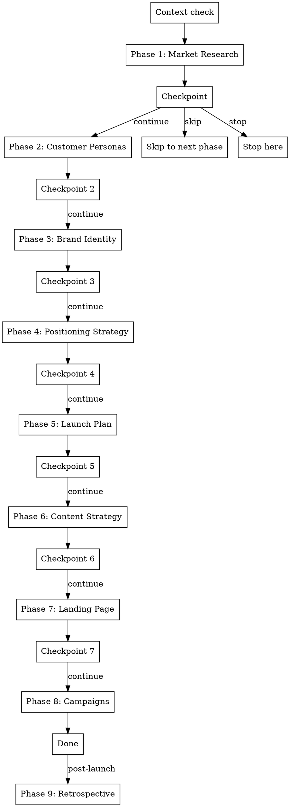

# Full Launch Workflow

## Overview

Guided end-to-end marketing workflow for new products. Walks through each phase in sequence, invoking the right skill at each step. Tracks progress via `docs/marketing/` files and lets you resume mid-workflow.

**Announce at start:** "I'm using the full-launch skill to guide you through the complete marketing workflow."

## Process

**Step 1: Context and progress check**

Check which `docs/marketing/` files already exist:

| File exists | Phase complete |
|---|---|
| `market-research.md` | Market research |
| `customer-personas.md` | Customer personas |
| `brand-identity.md` | Brand identity |
| `positioning-strategy.md` | Positioning strategy |
| `launch-plan.md` | Launch plan |
| `content-strategy.md` | Content strategy |
| `landing-page.md` | Landing page |
| `campaigns/*.md` | Campaigns |
| `launch-retrospective.md` | Retrospective |

If files exist, summarize: "You've already completed: [list]. Next phase is [phase]. Want to continue from there, redo any phase, or start fresh?"

If no files exist, ask: "What product or brand are we launching?" Then proceed to Phase 1.

**Step 2: Walk through phases**

Invoke each skill in order using the Skill tool. After each skill completes and writes its output file, present the checkpoint:

## Phase sequence

| Phase | Skill to invoke | Output file |
|---|---|---|
| 1 | `globalcoder-marketing:market-research` | `docs/marketing/market-research.md` |
| 2 | `globalcoder-marketing:customer-personas` | `docs/marketing/customer-personas.md` |
| 3 | `globalcoder-marketing:brand-identity` | `docs/marketing/brand-identity.md` |
| 4 | `globalcoder-marketing:positioning-strategy` | `docs/marketing/positioning-strategy.md` |
| 5 | `globalcoder-marketing:launch-plan` | `docs/marketing/launch-plan.md` |
| 6 | `globalcoder-marketing:content-strategy` | `docs/marketing/content-strategy.md` |
| 7 | `globalcoder-marketing:landing-page` | `docs/marketing/landing-page.md` |
| 8 | `globalcoder-marketing:campaign-builder` | `docs/marketing/campaigns/*.md` |
| 9 | `globalcoder-marketing:launch-retrospective` | `docs/marketing/launch-retrospective.md` |

Phase 9 (retrospective) is only suggested post-launch — don't include it in the main flow.

## Checkpoint format

After each phase completes:

> **Phase N complete.** [skill name] output saved to `docs/marketing/[file].md`.
>
> **Next up: [Phase N+1 name]** — [one-sentence description of what it does].
>
> Continue to next phase, skip it, or stop here?

## Resuming

If the user returns mid-workflow (files already exist), pick up where they left off. Don't re-run completed phases unless explicitly asked.

## Key Principles

- **One phase at a time** — never run multiple phases without a checkpoint
- **Respect existing work** — check for files before each phase, skip what's done
- **Let them stop anytime** — every checkpoint offers an exit
- **Each skill runs fully** — don't abbreviate skills when called from this workflow
- **Retrospective is post-launch** — suggest it at the end but don't run it in the main flow
