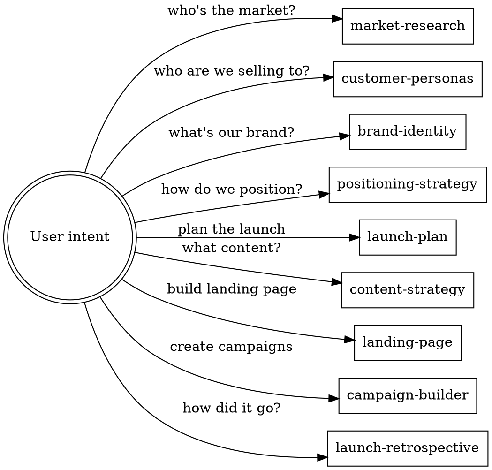

# Using globalcoder-marketing

## Overview

Entry point for the globalcoder-marketing plugin. Routes to the correct skill based on user intent.

**Invoke relevant marketing skills BEFORE any response.** If the user's task involves marketing, branding, launching, positioning, or content - check this routing table.

## Skill Routing

## Recommended Full-Launch Flow

market-research → customer-personas → brand-identity → positioning-strategy → launch-plan → content-strategy → landing-page / campaign-builder → launch-retrospective

All skills also work standalone. Each reads upstream docs from `docs/marketing/` if they exist.

## Output Mode

Every skill that produces artifacts asks at the start:

> **What output depth for this session?**
> 1. **Minimal** - Markdown documents only
> 2. **Full** - Markdown + code artifacts (structured data, templates, components)

## Companion Integration

This plugin works alongside globalcoder-workflow. Skills that produce actionable plans suggest:

> "Use `globalcoder-workflow:writing-plans` to break this into executable tasks."

No hard dependency. Suggestion only.
