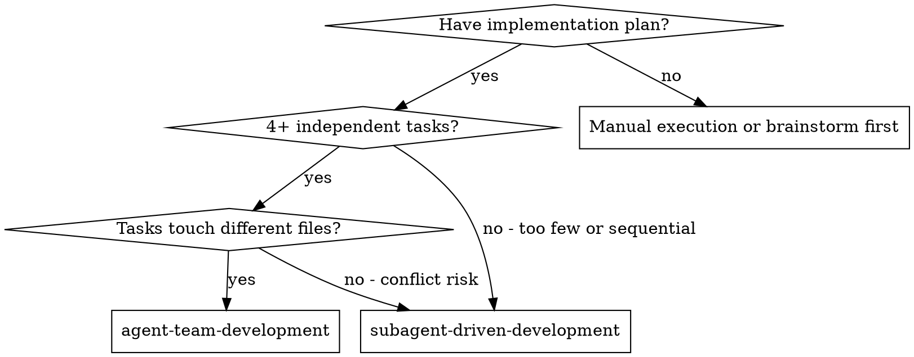
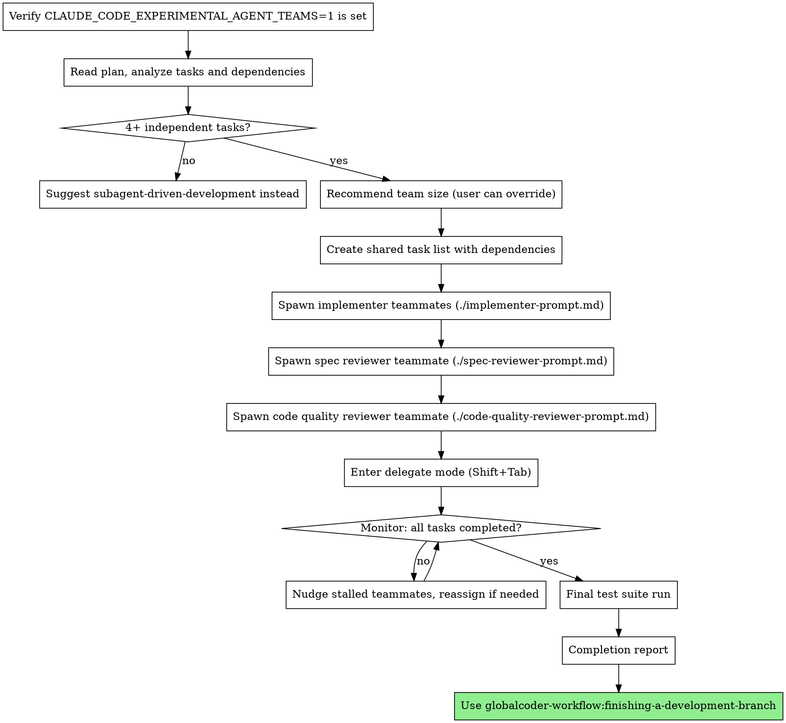

# Agent Team Development

Execute plan by spawning an agent team with parallel implementers and continuous async reviewers. The lead coordinates via delegate mode, implementers self-claim tasks, and reviewers review continuously as work completes.

**Core principle:** Parallel implementers + continuous async review = maximum throughput with quality gates preserved.

## When to Use



**vs. Subagent-Driven Development:**
- Parallel implementation (not sequential)
- Teammates communicate directly (not just report back)
- Reviewers accumulate context across tasks (not fresh each time)
- Higher token cost (each teammate is a separate session)

**vs. Executing Plans (parallel session):**
- Automated team coordination (not human-in-loop between batches)
- Parallel work (not sequential batches)
- Continuous review (not batch review)

**Prerequisites:**
- Implementation plan from globalcoder-workflow:writing-plans
- Agent teams enabled: set `CLAUDE_CODE_EXPERIMENTAL_AGENT_TEAMS=1` in settings.json or environment
- Clean git branch or worktree

## The Process



## Prerequisites Verification

Before proceeding with team creation, verify:

1. Check that `CLAUDE_CODE_EXPERIMENTAL_AGENT_TEAMS=1` is set in settings.json or environment. If not set, **STOP** and instruct the user:
   ```
   Agent teams require CLAUDE_CODE_EXPERIMENTAL_AGENT_TEAMS=1.
   Add this to your ~/.claude/settings.json under the "env" key, or export it in your shell.
   ```
2. Implementation plan exists (from globalcoder-workflow:writing-plans)
3. Clean git state

## Team Scaling

| Plan Size | Implementers | Reviewers | Notes |
|-----------|-------------|-----------|-------|
| 1-3 tasks | — | — | Suggest subagent-driven-development |
| 4-8 tasks | 2 | 2 (1 spec, 1 code quality) | Default for most plans |
| 9+ tasks | 3 | 2 (1 spec, 1 code quality) | Cap at 3 implementers |

User can override: "use 4 implementers" or "skip code quality review."

## Task Lifecycle

Task states use the shared task list (pending/in_progress/completed) plus messaging conventions for review:

```
pending → in_progress → needs_spec_review → needs_code_review → completed
          (task list)   (via message)        (via message)       (task list)
```

1. Implementer self-claims pending, unblocked task
2. Implements, tests, commits, self-reviews
3. Messages spec reviewer: "Task N ready for review" — moves on to next task
4. Spec reviewer reviews → pass: messages code quality reviewer / fail: messages implementer
5. Code quality reviewer reviews → pass: marks completed / fail: messages implementer
6. Implementer addresses feedback after finishing current task, not by interrupting

## Prompt Templates

- `./lead-prompt.md` - Lead coordination behavior
- `./implementer-prompt.md` - Spawn prompt for implementer teammates
- `./spec-reviewer-prompt.md` - Spawn prompt for spec reviewer teammate
- `./code-quality-reviewer-prompt.md` - Spawn prompt for code quality reviewer teammate

## Error Recovery

**Teammate crashes:** Spawn replacement with same role, reassign uncompleted tasks.
**Reviewer bottleneck:** Message reviewer to prioritize. Spawn additional reviewer if needed.
**Implementer stuck:** Message to check in. Reassign task to another implementer if no progress.
**File conflicts:** Pause one implementer, let other finish, then unblock. Dependency analysis should prevent most conflicts.
**Cross-task test failures:** Implementers stop claiming new tasks, fix failures first.

## Red Flags

**Never:**
- Let the lead implement tasks (delegate mode only)
- Skip spec review or code quality review
- Let implementers work on tasks that touch the same files simultaneously
- Proceed with failing tests
- Ignore reviewer feedback
- Spawn more than 3 implementers (coordination overhead exceeds benefit)

**If tasks are highly sequential:**
- Stop. Use subagent-driven-development instead.
- Agent teams add overhead without benefit for sequential work.

**If file conflicts arise:**
- Stop parallel work on conflicting files
- Add dependency between conflicting tasks
- Let one complete before the other starts

## Integration

**Required workflow skills:**
- **globalcoder-workflow:writing-plans** - Creates the plan this skill executes
- **globalcoder-workflow:finishing-a-development-branch** - Complete development after all tasks

**Pairs with:**
- **globalcoder-workflow:brainstorming** - Creates design doc referenced by reviewers
- **globalcoder-workflow:using-git-worktrees** - Creates isolated workspace
- **globalcoder-workflow:requesting-code-review** - Optional final review before merge
