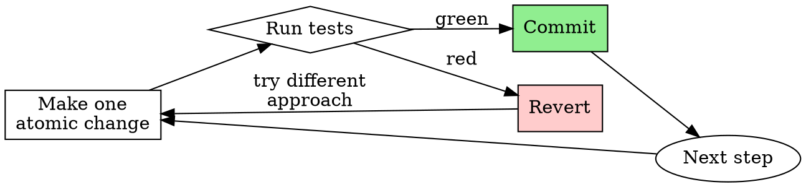

# Refactoring

## Overview

Disciplined approach to restructuring code without changing behavior.

**Core principle:** Never refactor in the dark. Every refactoring must have test coverage proving current behavior before any changes begin.

**Violating the letter of this process is violating the spirit of refactoring.**

## The Iron Law

```
NO STRUCTURAL CHANGES UNTIL TESTS COVER THE TARGET CODE
```

If tests don't cover the code you're about to change, writing them IS the first step.

## When to Use

**Use for:**
- Restructuring modules or moving files
- Renaming across multiple files
- Extracting components, hooks, or utilities
- Changing data flow patterns
- Migrating between patterns or libraries
- Any change that affects structure but not behavior

**Don't use for:**
- Single-function tweaks (just refactor inline)
- Bug fixes that change behavior (use globalcoder-workflow:systematic-debugging)
- Adding new features (use globalcoder-workflow:test-driven-development)

## The Four Phases

### Phase 1: Scope & Safety Net

1. **Define the goal** in one sentence: what changes, what stays the same
2. **Map the blast radius:** list every file, component, and interface affected
3. **Verify test coverage** on all affected code
   - Run existing tests. What's covered?
   - If coverage gaps exist → write characterization tests first
   - Characterization tests capture CURRENT behavior (even if ugly)
4. **Run full test suite** → all green before proceeding
5. **Hard gate: NO STRUCTURAL CHANGES UNTIL TESTS COVER THE TARGET CODE**

### Phase 2: Plan the Moves

1. **Break into atomic steps** — each step = one commit, tests stay green after every commit
2. **Identify dependency order** — what must move first?
3. **Flag public API/interface changes** — consumers must be updated in the same step
4. **Prefer parallel implementation pattern:**
   - Build the new structure alongside the old
   - Migrate callers one by one
   - Delete the old structure last

### Phase 3: Execute Incrementally

1. **One atomic step at a time**
2. After each step: run tests → verify green → commit
3. **If tests break: REVERT the step.** Don't debug forward.
4. **Hard gate: NEVER STACK MULTIPLE UNCOMMITTED REFACTORING STEPS**



### Phase 4: Verify & Clean Up

1. Run full test suite one final time
2. Run build
3. Search for dead code: unused imports, orphaned files, unreferenced exports
4. Delete dead code (git has history — no commented-out code)
5. Final commit

## Rationalization Table

| Thought | Reality |
|---------|---------|
| "I'll write tests after refactoring" | You won't know what broke. Tests first. |
| "This is a simple rename, no tests needed" | Renames cascade. One test catches the miss. |
| "I'll do these two steps together, they're related" | Related steps still break independently. One at a time. |
| "I can fix this bug while I'm in here" | Bug fixes are separate commits. Don't mix. |
| "Reverting wastes my progress" | Reverting saves your sanity. Debug-forward compounds errors. |
| "The tests are slow, I'll batch changes" | Slow tests + broken code = slower debugging. Run them. |
| "I know what all the callers are" | Grep. You missed one. |

## Red Flags — STOP

- Making structural changes without tests covering the target code
- Stacking multiple uncommitted changes
- Fixing bugs during a refactoring step
- Debugging forward instead of reverting
- Skipping test runs between steps
- "Just one more change before I commit"

**All of these mean: STOP. Commit or revert. One step at a time.**

## Stack-Specific Appendix

### React/TypeScript
- Use IDE rename for symbols (not find-replace) — catches all references including types
- When extracting components: keep props interface in same file initially, extract to shared types only if reused
- When migrating state management: run old and new side-by-side before cutting over
- Moving files? Update all import paths in one commit, verify build passes

### Supabase/Database-backed
- If refactoring touches data-fetching hooks: verify RLS policies still apply after restructuring
- If renaming database-related types: check `integrations/supabase/types.ts` alignment
- Don't refactor DB queries and UI in the same step

### General patterns
- Changing function signatures? Find all callers first (`Grep` for function name), update all in same commit
- Moving files between directories? Update imports, verify build, then commit
- Extracting shared utilities? Create the utility, migrate ONE caller, verify, commit. Then migrate the rest.

## Integration

**Pairs with:**
- **globalcoder-workflow:test-driven-development** — Write characterization tests in Phase 1
- **globalcoder-workflow:verification-before-completion** — Verify tests pass before claiming done
- **globalcoder-workflow:requesting-code-review** — Review after major refactoring complete

## Quick Reference

| Phase | Gate | Key Action |
|-------|------|------------|
| 1. Scope & Safety Net | Tests cover target code | Write characterization tests if gaps exist |
| 2. Plan the Moves | Atomic steps identified | Prefer parallel implementation pattern |
| 3. Execute Incrementally | Tests green after every commit | Revert if red, never stack changes |
| 4. Verify & Clean Up | Full suite green, no dead code | Delete orphaned code, final commit |
